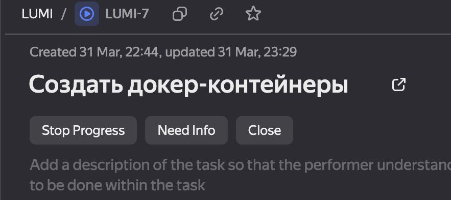
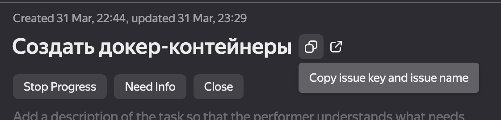

# Подход к коммитам и прам

## Именование веток и коммитов

Для разработки фичи отводим ветку (копируем название из трэкера LUMI-7 в данном случае)

После написания кода коммитим и создаем pr (копируем название возле названия тикета)

## Не мержим пры без ока от другого участника фронта
